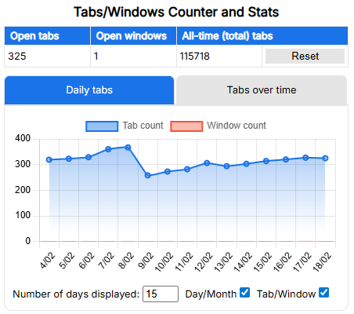
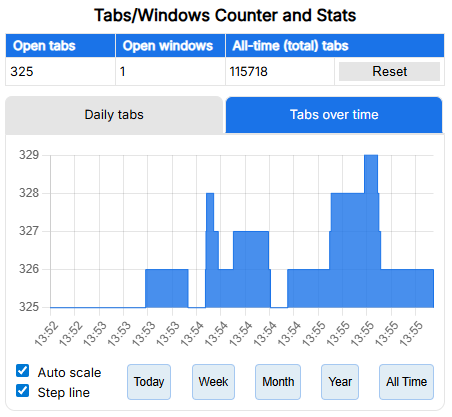

# Tabs/Windows Counter and Stats

This is a Chrome extension that keeps track of the number of tabs and windows opened and displays a chart of the data collected over a specific period of time using [Chart.js](https://www.chartjs.org/).

Get it on the Chrome webstore: [🔗 Tabs/Windows Counter and Stats](https://chromewebstore.google.com/detail/tabswindows-counter-and-s/oihkkgbnlimoffcljflafghgmaocambp)

## Preview

|  |  |
|-------------------------------------------------|-------------------------------------------------|

## Info

This extension was (originally) developed in cooperation with OpenAI's ChatGPT (Mar 14, 2023 version) as an experiment to explore its capabilities and how well it works in tandem with a programmer who has little-to-no experience in developing browser extensions. The extension wasn't a result of a single text prompt but of a (quite long) process of trial and error, just to get to a working solution. I do not recommend reusing this code directly without first removing repetitions, redundancy and other possible errors due to LLM hallucinations. Use it at your own risk. It just works well enough for my needs :)

> [!NOTE]
> [***v1.4 and later – 2025***] I updated the extension with a new time graph, using more modern LLMs (GPT-4o and o1) through GitHub Copilot, so the information above is only partially correct.

## License

The code is licensed under the [MIT License](https://choosealicense.com/licenses/mit/).

## Star History

<a href="https://www.star-history.com/#SamMed05/tab-counter-stats&type=date&legend=top-left">
 <picture>
   <source media="(prefers-color-scheme: dark)" srcset="https://api.star-history.com/svg?repos=SamMed05/tab-counter-stats&type=date&theme=dark&legend=top-left" />
   <source media="(prefers-color-scheme: light)" srcset="https://api.star-history.com/svg?repos=SamMed05/tab-counter-stats&type=date&legend=top-left" />
   
 </picture>
</a>
